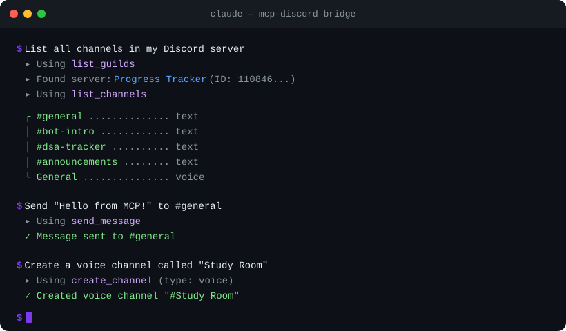

# Discord MCP Server

Control your Discord server using AI. Works with **any MCP-compatible app** — Claude Desktop, Cursor, Windsurf, Continue.dev, Zed, Claude Code, and more.

> **What is MCP?** Model Context Protocol is an open standard that lets AI apps talk to external tools. This project is one of those tools — it gives any AI assistant the power to manage your Discord server.

<p align="center">
  
</p>

---

## What Can It Do?

Once connected, your AI assistant can:

- **Channels** — create, delete, rename, move channels and categories
- **Messages** — read, send, edit, delete, search messages, send DMs, add/remove reactions
- **Forum Channels** — list forums, create/read/reply/delete forum posts
- **Webhooks** — create, send via, edit, and delete webhooks
- **Members** — list members, view profiles, check roles
- **Roles** — list, create, edit, delete, assign, and remove roles
- **Moderation** — kick, ban, unban, timeout members, set nicknames
- **Threads** — create, list, archive, unarchive, join, and delete threads
- **Server** — list all servers the bot is in, view channel layouts

It also runs as a **standalone Discord bot** with `/ping`, `/info`, and `/serverinfo` slash commands.

---

## Quick Start (3 minutes)

### Step 1: Create a Discord Bot

1. Go to the [Discord Developer Portal](https://discord.com/developers/applications)
2. Click **New Application** — give it a name
3. Go to **Bot** tab — click **Reset Token** — copy and save the token somewhere safe

### Step 2: Invite the Bot to Your Server

1. In the Developer Portal, go to **OAuth2 > URL Generator**
2. Check these scopes: `bot`, `applications.commands`
3. Check these permissions: `Send Messages`, `Read Message History`, `Manage Channels`, `Manage Roles`, `Manage Webhooks`, `Kick Members`, `Ban Members`, `Moderate Members`, `Manage Nicknames`
4. Open the generated URL — select your server — authorize

### Step 3: Add to Your AI App

Add this to your app's MCP config — **no cloning or installing needed**:

```json
{
  "mcpServers": {
    "discord": {
      "command": "npx",
      "args": ["-y", "mcp-discord-bridge"],
      "env": {
        "DISCORD_TOKEN": "paste_your_bot_token_here"
      }
    }
  }
}
```

**Where is the config file?**

| App | Config Location |
|-----|----------------|
| **Claude Desktop** | Windows: `%APPDATA%\Claude\claude_desktop_config.json` · macOS: `~/Library/Application Support/Claude/claude_desktop_config.json` |
| **Claude Code** | `~/.claude.json` (or run `/mcp` in Claude Code) |
| **Cursor** | Settings > search "MCP" > Edit MCP Settings |
| **Windsurf** | `~/.codeium/windsurf/mcp_settings.json` |
| **Continue.dev** | `~/.continue/config.json` |
| **Zed** | `~/.config/zed/settings.json` |

> For detailed per-app instructions, see [CONNECTING.md](./CONNECTING.md).

### Step 4: Done!

Restart your AI app. You should now see Discord tools available. Try asking:

> *"List all channels in my Discord server"*

---

## All Available Tools (46)

| Tool | What It Does |
|------|-------------|
| **Server** | |
| `list_guilds` | List all servers the bot is in |
| `list_channels` | List all channels and categories |
| **Channels** | |
| `create_category` | Create a new category |
| `create_channel` | Create a text or voice channel |
| `delete_channel` | Delete a channel or category |
| `move_channel` | Move a channel to a different category |
| `rename_channel` | Rename a channel or category |
| **Messages** | |
| `get_channel_messages` | Fetch recent messages (up to 100) |
| `send_message` | Send a message to a channel |
| `delete_message` | Delete a message |
| `edit_message` | Edit a bot message |
| `search_messages` | Search messages by keyword |
| `send_dm` | Send a direct message to a user |
| `add_reaction` | Add an emoji reaction to a message |
| `remove_reaction` | Remove the bot's reaction from a message |
| `add_multiple_reactions` | Add multiple reactions at once |
| **Forum Channels** | |
| `list_forum_channels` | List all forum channels in a server |
| `create_forum_post` | Create a new forum post |
| `get_forum_post` | Fetch a forum post and its messages |
| `reply_to_forum_post` | Reply to a forum post |
| `delete_forum_post` | Delete a forum post |
| **Webhooks** | |
| `create_webhook` | Create a webhook for a channel |
| `send_webhook_message` | Send a message via webhook |
| `edit_webhook` | Edit a webhook |
| `delete_webhook` | Delete a webhook |
| **Members** | |
| `list_members` | List server members with roles |
| `get_member` | Get detailed info about a member |
| **Roles** | |
| `list_roles` | List all roles in a server |
| `assign_role` | Give a role to a member |
| `remove_role` | Take a role from a member |
| `create_role` | Create a new role with name, color, mentionable |
| `edit_role` | Edit a role's name or color |
| `delete_role` | Delete a role from the server |
| **Moderation** | |
| `kick_member` | Kick a member from the server |
| `ban_member` | Ban a user (with optional message cleanup) |
| `unban_member` | Unban a previously banned user |
| `timeout_member` | Timeout (mute) a member for a duration |
| `set_nickname` | Set or reset a member's nickname |
| **Threads** | |
| `create_thread` | Create a thread in a text channel |
| `list_threads` | List active and archived threads |
| `archive_thread` | Archive a thread (optionally lock it) |
| `unarchive_thread` | Unarchive a thread |
| `join_thread` | Make the bot join a thread |
| `delete_thread` | Delete a thread |

---

## Install from Source (for contributors)

If you want to modify the code or run the standalone bot:

```bash
git clone https://github.com/iprashantraj/mcp-discord-bridge.git
cd mcp-discord-bridge
npm install
cp .env.example .env   # fill in DISCORD_TOKEN, CLIENT_ID, GUILD_ID
```

Then use ts-node to run directly:

```json
{
  "mcpServers": {
    "discord": {
      "command": "npx",
      "args": ["ts-node", "/full/path/to/mcp-discord-bridge/mcp-server.ts"],
      "env": {
        "DISCORD_TOKEN": "paste_your_bot_token_here"
      }
    }
  }
}
```

---

## Running as a Standalone Bot

If you just want the slash commands without MCP:

```bash
# Register commands (one time)
npm run deploy-commands

# Start the bot
npm run bot
```

| Command | Description |
|---------|-------------|
| `/ping` | Check bot latency |
| `/info` | Show bot uptime and stats |
| `/serverinfo` | Show server details |

---

## Docker Deployment

Run the bot 24/7 on a server or Raspberry Pi:

```bash
docker-compose up -d       # Start in background
docker-compose logs -f     # View logs
```

---

## Development

```bash
npm run typecheck    # Type check
npm run lint         # Lint
npm run test         # Run tests (53 tests)
npm run format       # Format code
```

CI runs automatically on every push and PR via GitHub Actions.

### Project Structure

```
mcp-discord-bridge/
├── discord-client.ts     # Shared Discord client setup
├── mcp-server.ts         # MCP server (tool schemas + wiring)
├── mcp-handlers.ts       # Tool handler logic (registry pattern)
├── index.ts              # Standalone bot (slash commands)
├── deploy-commands.ts    # One-time command registration
├── tests/                # Vitest test suite
├── .github/workflows/    # CI pipeline
├── Dockerfile            # Multi-stage Docker build
└── CONNECTING.md         # Detailed per-app setup guide
```

---

## Security

- **Never commit your `.env` file** — it's already in `.gitignore`
- Treat your `DISCORD_TOKEN` like a password — if leaked, regenerate it immediately in the Developer Portal
- The bot can only assign roles **below its own role** in the hierarchy (Discord enforces this)

---

## License

[MIT](./LICENSE) — use it however you want.
