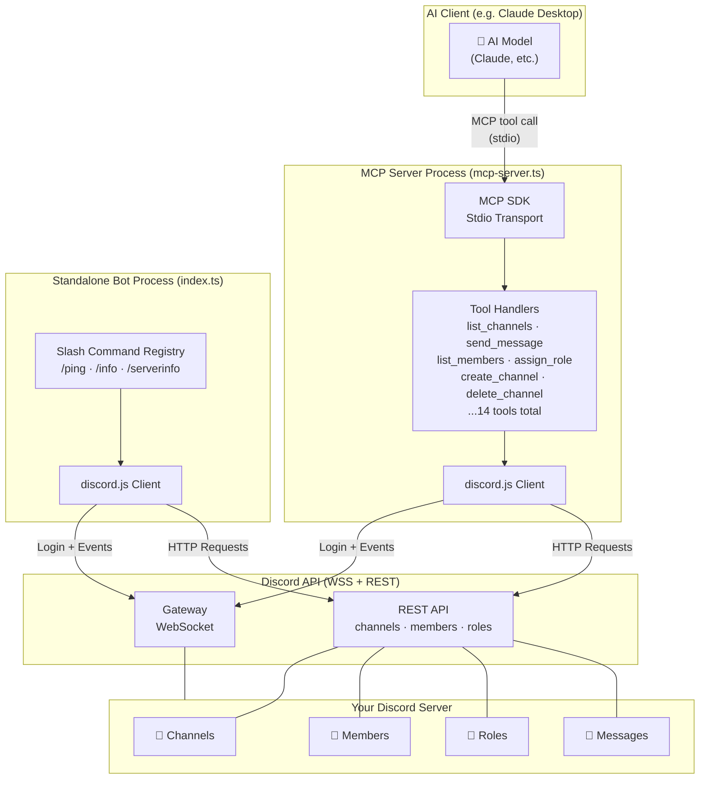
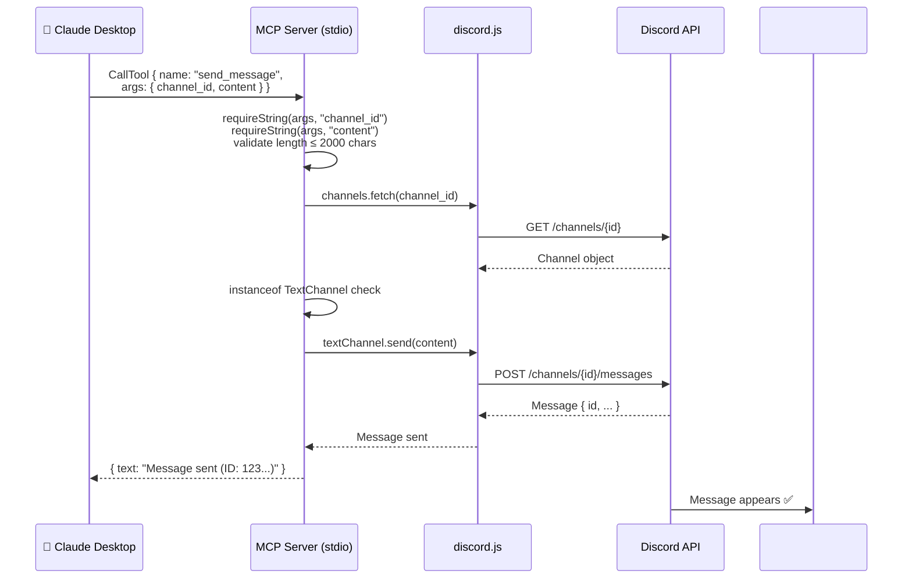

# Discord MCP Server — Project Overview

## What Does This Project Do?

This project is a **bridge between AI assistants (like Claude) and Discord** using the [Model Context Protocol (MCP)](https://modelcontextprotocol.io/). It ships in two modes that share the same Discord bot credentials but serve very different purposes.

---

## Two Modes, One Bot

### 🔌 Mode 1 — MCP Server (`mcp-server.ts`)
This is the **core purpose** of the project.

It runs a local server that speaks the **MCP protocol over stdio**. Any MCP-compatible AI client (Claude Desktop, Cursor, etc.) can connect to it and call Discord tools as if they were native AI capabilities.

**What the AI can do through it:**
- List all Discord servers the bot is in
- Browse channels and categories in any server
- Create, rename, move, delete channels and categories
- Read recent messages from any text channel
- Send messages to any channel
- List server members (with their roles)
- Look up a specific member's full profile
- List all roles in a server
- Assign or remove roles from members (with audit log reasons)

The AI doesn't interact with Discord directly — it calls tools on this MCP server, which translates them into Discord API calls via `discord.js`.

---

### 🤖 Mode 2 — Standalone Bot (`index.ts`)
A traditional slash-command Discord bot. Useful for testing the connection and showing the bot is online in a server.

| Command | What it does |
|---|---|
| `/ping` | Shows round-trip + WebSocket latency as an embed |
| `/info` | Shows bot uptime, guild count, tech stack |
| `/serverinfo` | Shows server owner, member count, channels, roles, creation date |

---

## Architecture Diagram

---

## Data Flow — MCP Tool Call Example

Here's exactly what happens when Claude calls `send_message`:

---

## Why MCP?

Without MCP, you'd have to:
1. Build a custom API
2. Write code to authenticate Claude against it
3. Describe each capability manually in your prompt

With MCP, you just **run the server**, **point your Claude Desktop config at it**, and Claude immediately has structured, typed, discoverable tools for Discord — no prompt engineering needed. The AI knows what tools exist, what parameters they take, and what they return.

---

## Key Design Decisions

| Decision | Why |
|---|---|
| **stdio transport** | Zero networking setup — works out of the box with Claude Desktop |
| **Single bot token, two entry points** | MCP server and standalone bot can run independently without code duplication |
| **Typed input helpers** (`requireString`, etc.) | Replaces unsafe `args!` assertions with clear error messages for the AI |
| **`instanceof` type guards** | Eliminates `(ch as any)` casts — TypeScript actually catches wrong channel types |
| **Login timeout (15s)** | Prevents silent hang if the token is wrong or network is down |
| **Audit log reasons** | Destructive operations (delete, role changes) leave a paper trail in Discord |
